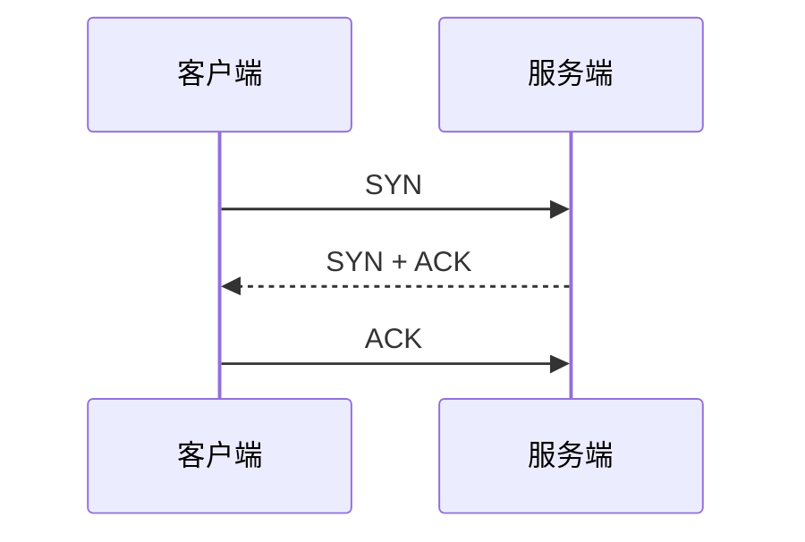

# ExamForge 设计规范

## 1. 产品定位

ExamForge 是一个面向大学生的期末复习工具。它不自带 AI 能力，而是作为一组 **MCP 工具 + Web 前端**，让任意支持 MCP 协议的 Agent（Claude Desktop、Trae、Cursor 等）能够通过调用工具在用户浏览器中渲染结构化内容、出题、收集答案、追踪进度。

核心原则：

- **Agent 是大脑，前端是显示器和输入设备。** Agent 完全掌控学习流程、内容生成、策略调整；前端负责渲染和收集用户输入。
- **工具箱，不是流程引擎。** ExamForge 不规定任何学习流程（先规划还是先做题、要不要出题、要不要追踪进度），一切由 Agent 自主决定。
- **个人工具。** 单用户、本地运行，不需要后端服务器、用户系统或数据隔离。

## 2. 架构

```
┌──────────────────────────────────────────────┐
│  Agent (Claude Desktop / Trae / Cursor 等)    │
│  - 分析参考资料，自主决定教学策略              │
│  - 调用 MCP 工具操控前端                        │
│  - 根据用户反馈动态调整                         │
└──────────────┬───────────────────────────────┘
               │ MCP Protocol (stdio)
               ▼
┌──────────────────────────────────────────────┐
│  ExamForge MCP Server (Node.js)               │
│  - 暴露 MCP tools 供 Agent 调用               │
│  - 维护状态（消息队列、做题记录、进度）         │
│  - 通过 WebSocket 推送指令到前端                 │
│  - 执行代码沙箱（编程题判题用）                 │
└──────────────┬───────────────────────────────┘
               │ WebSocket
               ▼
┌──────────────────────────────────────────────┐
│  ExamForge Web UI (浏览器 localhost:3456)      │
│  - 知识画板：扩展 Markdown 渲染                │
│  - 题目系统：选择/填空/简答/编程               │
│  - 仪表盘：Agent 自由填充的数据面板             │
│  - 用户输入：做题答案、消息、快捷反馈           │
│  - 错题本 / 收藏 / 历史记录                   │
│  - 多模型即时问答（直连 API）                   │
└──────────────────────────────────────────────┘
```

### 三大组件

1. **MCP Server**：Node.js 进程，通过 stdio 与 Agent 通信，通过 WebSocket 与前端通信。这是 ExamForge 的核心。
2. **Web 前端**：纯静态 SPA， served by MCP Server 内置的 HTTP server。所有数据持久化在本地文件系统。
3. **Agent**：用户自选的外部 Agent，通过 MCP 协议连接到 ExamForge MCP Server。

### 通信机制

- **Agent → 前端**：Agent 调用 MCP 工具 → MCP Server 通过 WebSocket 推送指令到前端 → 前端渲染
- **前端 → Agent**：用户操作（提交答案、发消息）→ 存入 MCP Server 消息队列 → Agent 调用 `wait_for_response` 时批量返回
- **前端 → 自定义模型**：前端直连模型 API（OpenAI 兼容格式），不经 MCP Server，不经过 Agent

## 3. MCP 工具集

共 14 个工具，分为 4 类。Agent 自由选用，ExamForge 不强制任何调用顺序或组合。

### 3.1 渲染类（Agent → 前端）

#### `show_card`

渲染一张知识卡片到主内容区。支持扩展 Markdown 语法（见第 5 节）。

参数：
```json
{
  "title": "进程调度",
  "content": "## 3.1 进程状态\n\n进程有三种基本状态..."
}
```

- `title`（string，必填）：卡片标题
- `content`（string，必填）：扩展 Markdown 格式的内容

行为：替换主内容区当前内容。如果之前有卡片，覆盖之。

#### `clear_board`

清空主内容区。

参数：无。

#### `show_quiz`

渲染一组题目到主内容区，进入做题模式。

参数：
```json
{
  "mode": "sequential",
  "questions": [
    {
      "id": "q1",
      "type": "choice",
      "question": "进程调度的 FCFS 算法的特点是？",
      "options": ["响应时间最短", "实现简单", "平均等待时间最优", "适合交互式系统"],
      "answer": 1
    },
    {
      "id": "q2",
      "type": "fill",
      "question": "信号量的 P 操作对应的具体函数是 _________",
      "answer": "wait()"
    },
    {
      "id": "q3",
      "type": "short_answer",
      "question": "简述死锁产生的四个必要条件",
      "answer": "互斥、持有并等待、不可抢占、循环等待"
    },
    {
      "id": "q4",
      "type": "code",
      "question": "用信号量实现读者-写者问题（读者优先）",
      "language": "c",
      "answer": "sem_t rw_mutex, read_count_mutex; int read_count = 0; ...",
      "test_cases": [
        {"input": "", "expected": "no deadlock"}
      ]
    }
  ]
}
```

- `mode`（string，可选）：`"sequential"`（逐题模式，默认）或 `"batch"`（批量模式，一次显示全部）
- `questions`（array，必填）：题目数组，每个题目的字段：
  - `id`（string，必填）：题目唯一标识
  - `type`（string，必填）：`"choice"` / `"fill"` / `"short_answer"` / `"code"`
  - `question`（string，必填）：题目文本
  - `answer`（string/number/array，必填）：正确答案
  - `options`（array，仅 choice）：选项列表
  - `language`（string，仅 code）：编程语言
  - `test_cases`（array，仅 code）：测试用例

#### `show_result`

渲染做题结果。在 `show_quiz` 之后由 Agent 调用。

参数：
```json
{
  "results": [
    {"id": "q1", "correct": true},
    {"id": "q2", "correct": false, "user_answer": "signal()", "explanation": "P操作对应wait()，记忆技巧：P = Pause = 等待"},
    {"id": "q3", "correct": true, "user_answer": "互斥、持有并等待、不可抢占、循环等待"},
    {"id": "q4", "correct": false, "user_answer": "...", "explanation": "缺少对 read_count 的互斥保护", "code_output": "运行结果：..."}
  ],
  "summary": {
    "accuracy": 0.75,
    "time_spent": 480,
    "feedback": "信号量概念需要加强，建议复习后重做 q2"
  }
}
```

#### `update_dashboard`

更新侧边栏仪表盘内容。Agent 自由决定展示什么数据。

参数：
```json
{
  "widgets": [
    {"type": "stat", "label": "当前正确率", "value": "78%", "trend": "up"},
    {"type": "list", "title": "复习进度", "items": [
      {"label": "进程管理", "status": "done", "detail": "92%"},
      {"label": "内存管理", "status": "current", "detail": "进行中"},
      {"label": "文件系统", "status": "pending", "detail": "未开始"}
    ]},
    {"type": "text", "content": "建议下次集中攻克内存管理"}
  ]
}
```

支持的 widget 类型：`stat`（数值统计）、`list`（列表）、`text`（文本块）、`progress`（进度条）。

#### `set_progress`

设置顶部全局进度条。

参数：
```json
{
  "percent": 62,
  "label": "操作系统复习进度"
}
```

#### `set_session_title`

设置当前会话名称。

参数：
```json
{
  "title": "操作系统"
}
```

#### `show_toast`

弹出轻量提示消息。

参数：
```json
{
  "text": "进入第三章：内存管理",
  "type": "info"
}
```

- `type`（string，可选）：`"info"`（默认）、`"success"`、`"warning"`、`"error"`

### 3.2 交互读取类（前端 → Agent）

#### `wait_for_response`

阻塞等待用户操作。这是 Agent 获取用户反馈的唯一方式。

参数：
```json
{
  "timeout": 300
}
```

- `timeout`（number，可选，默认 300）：最长等待秒数。超时返回空数组。

返回值：
```json
{
  "messages": [
    {"type": "quiz_answer", "data": {"q1": 1, "q2": "wait()", "q3": "互斥...", "q4": "sem_t ..."}},
    {"type": "message", "text": "这章我之前学过，可以跳过"},
    {"type": "feedback", "data": {"card_id": "xxx", "action": "understood"}}
  ]
}
```

消息类型：
- `quiz_answer`：用户提交的做题答案，`data` 中包含各题的答案
- `message`：用户在底部输入框发送的文字消息
- `feedback`：用户在知识卡片上的快速反馈（`action` 可选 `"understood"` / `"confused"` / `"skip"`）
- `quiz_action`：用户在做题过程中的操作（`action` 可选 `"peek_answer"` 查看答案但不提交、`"give_up"` 跳过本题直接看解析），`data` 中包含题目 `id`
- `review_request`：用户在错题本中点击"重做错题"，`data` 中包含要重做的题目 id 列表

**阻塞机制**：MCP Server 在内部挂住此调用（基于 MCP 持久连接），不消耗 Agent token。当用户有动作时立刻返回（即时唤醒），不等 timeout。

#### `ask_choice`

弹出选择框，让用户选一个选项。

参数：
```json
{
  "question": "这章掌握得怎么样？",
  "options": ["掌握了，继续下一章", "还行，但有些地方模糊", "不太熟，再讲一遍"]
}
```

返回值：
```json
{
  "selected": 1,
  "text": "还行，但有些地方模糊"
}
```

### 3.3 数据读取类（Agent 查询前端持久化数据）

#### `get_wrong_answers`

读取当前会话的错题本。

参数：
```json
{
  "chapter": "进程管理",
  "since": "2026-07-09"
}
```

- `chapter`（string，可选）：按章节筛选
- `since`（string，可选）：筛选该日期之后的错题

返回值：错题数组，每条包含题目原文、用户答案、正确答案、解析、时间戳。

#### `get_history`

读取当前会话的学习历史记录。

参数：
```json
{
  "limit": 20
}
```

返回值：近期学习活动列表（展示过的卡片、做过的题目组及结果、时间戳）。

#### `get_qa_history`

读取当前会话中通过自定义模型产生的问答记录。

参数：无。

返回值：问答数组，每条包含问题、回答、使用的模型、时间戳。

### 3.4 执行类

#### `run_code`

在本地沙箱中执行代码，用于编程题判题。

参数：
```json
{
  "language": "python",
  "code": "def add(a, b):\n    return a + b",
  "test_cases": [
    {"input": "3\n5", "expected": "8"},
    {"input": "0\n0", "expected": "0"}
  ]
}
```

- `language`（string，必填）：`"python"` / `"javascript"` / `"java"` / `"c"` / `"cpp"`
- `code`（string，必填）：用户提交的代码
- `test_cases`（array，必填）：测试用例

返回值：
```json
{
  "results": [
    {"passed": true, "actual": "8", "expected": "8", "time_ms": 12},
    {"passed": true, "actual": "0", "expected": "0", "time_ms": 8}
  ],
  "exit_code": 0
}
```

安全限制：
- 执行时间上限：3 秒
- 内存上限：256MB
- 禁止文件系统写入和网络访问
- 仅支持标准库

## 4. 用户交互系统

### 4.1 消息队列机制

用户在底部输入框发送的消息**不直接触发 Agent 调用**，而是进入 MCP Server 的消息队列。

Agent 调用 `wait_for_response` 时，队列中的所有消息一次性批量返回。Agent 一次调用处理全部待处理消息，节省 token 和上下文。

用户感知：消息发送后显示"已记录"，不产生等待感。

### 4.2 即时唤醒

当 Agent 正阻塞在 `wait_for_response` 中时，如果用户发送了消息或提交了答案，MCP Server 立刻解除阻塞并返回，不等 timeout 到期。

这是 MCP Server 内部实现机制（基于事件监听），对 Agent 透明。

### 4.3 本地知识匹配

用户发送消息时，前端先在本地已展示的知识卡片中搜索关键词：
- **高匹配度**：前端弹出提示"你之前学过这个"，展示相关卡片，标记为已查看，不发送给 Agent
- **低匹配度或无匹配**：消息进入队列，等 Agent 处理

零 Agent 调用即可解决大量回顾性问题。

### 4.4 多模型即时问答

底部输入框左侧有模型选择器，用户可选择由哪个模型回答当前问题。

**Agent 模式（默认）**：消息进入队列，等 Agent 来取。

**自定义模型模式**：前端直连模型 API（OpenAI 兼容格式），即时返回回答。回答展示在输入框上方的轻量对话面板中，不替换主内容区。

支持的配置：
- 模型名称、API 地址、API Key、模型 ID
- 前期仅支持 DeepSeek，可扩展
- API Key 本地加密存储

**记忆开关**：
- ON：自定义模型的问答维护一个独立的上下文窗口，连续追问不需要重复背景
- OFF：每次提问独立，零上下文

记忆模式下的回答也会存入本地知识库，供本地知识匹配和 `get_qa_history` 使用。

### 4.5 快捷键

快捷键仅在特定视图和输入框失焦时生效：

| 快捷键 | 作用域 | 功能 |
|--------|--------|------|
| `1` `2` `3` `4` | 做题视图（选择题） | 快速选择选项 |
| `A` `B` `C` `D` | 做题视图（选择题） | 同上（备选） |
| `Enter` | 做题视图 | 提交当前题目 |
| `→` / `↓` | 做题视图（批量模式） | 下一题 |
| `←` / `↑` | 做题视图（批量模式） | 上一题 |
| `Shift+Enter` | 做题视图 | 显示/隐藏当前题答案 |
| `Tab` | 画板视图 | 展开/折叠当前卡片 |
| `Ctrl+Enter` | 底部输入框聚焦时 | 发送消息 |
| `Esc` | 问答面板 | 收起问答面板 |
| `F` | 全局 | 切换专注模式 |
| `D` | 全局 | 切换深色/浅色模式 |
| `?` | 全局 | 弹出快捷键帮助面板 |

输入框聚焦时，除 `Ctrl+Enter` 和 `Esc` 外的所有快捷键失效。

## 5. 扩展 Markdown 语法

`show_card` 的 `content` 字段使用扩展 Markdown，在标准 Markdown 基础上增加以下语法：

### 数学公式

行内公式使用 `$...$`，块级公式使用 `$$...$$`，由 KaTeX 渲染。

```
进程调度算法的时间复杂度为 $O(n^2)$。

$$T_{avg} = \frac{1}{n} \sum_{i=1}^{n} T_i$$
```

### 代码块

标准围栏代码块，带语言标识的自动语法高亮和复制按钮。

````markdown
```c
void P(semaphore *s) {
    while (s->value <= 0)
        block(s->queue);
    s->value--;
}
```
````

### 图片

标准 Markdown 图片语法，支持本地路径和 URL。点击可放大。

```markdown

```

### PDF 预览

自定义语法，内嵌 PDF 阅读器。

```markdown
!pdf(uploads/ch3_notes.pdf, pages=12-13)
```

### 折叠区域

自定义语法，可折叠的内容块。

```markdown
!!! 折叠：详细推导过程
由 P 操作的定义可知...
包含多行内容。
!!!
```

### 高亮提示框

使用 blockquote 加 emoji 前缀，渲染为带颜色的提示框。

```markdown
> 💡 记忆技巧：P = Pause = 等待，V = Vacuum = 释放

> ⚠️ 易错点：信号量初值必须为 1 才能当互斥锁用

> 📌 考点：死锁的四个必要条件是常考简答题
```

支持的 emoji 前缀：💡（提示/技巧）、⚠️（警告/易错）、📌（考点/重点）、❌（错误示范）。

### 语义学习块

使用 remark-directive 容器表达内容的学习作用。支持 `callout`、`compare`、`steps`、`formula`、`memory-card`、`concept`、`example`、`checkpoint`、`mistake` 和 `source`。

```markdown
:::callout{type="trap" title="常见陷阱"}
不要把相关性直接解释为因果关系。
:::

:::steps{title="求解流程"}
1. 明确已知量
2. 选择公式
3. 代入并检查单位
:::
```

`memory-card` 使用 `prompt` 属性作为回忆提示，正文答案默认折叠。旧 `memory` 和 `diagram` 指令继续兼容。

### Mermaid 图表

标准 Mermaid fence 用于流程、时序、状态、层级和关系图，并随应用深浅主题重新渲染。

````markdown

````

### HTML 交互预览

`html-preview` fence 在 `sandbox="allow-scripts"` 的隔离 iframe 中运行完整 HTML、CSS 和 JavaScript，用于 Mermaid 无法表达的自定义布局、动画、模拟器和交互工具。

````markdown
```html-preview title="交互演示" height="auto"
<!doctype html>
<html>
<style>/* responsive CSS */</style>
<body>...</body>
<script>/* interaction */</script>
</html>
```
````

## 6. 做题体验

### 6.1 题目类型

| 类型 | 前端自动判题 | 说明 |
|------|------------|------|
| `choice` | 是 | 单选题，`1-4` 或 `A-D` 快捷键可选 |
| `fill` | 模糊匹配 | 填空题，去除首尾空格和大小写后匹配 |
| `short_answer` | 否 | 简答题，由 Agent 通过 `wait_for_response` 拿到答案后自行判断 |
| `code` | 通过 `run_code` | 编程题，Agent 调用 `run_code` 执行后判题 |

### 6.2 做题模式

**逐题模式**（`sequential`，默认）：
- 一次展示一道题
- 提交后立刻显示对错和解析
- 自动进入下一题
- 适合 Agent 想即时反馈的场景

**批量模式**（`batch`）：
- 所有题目同时展示
- 用户做完所有题后统一提交
- Agent 拿到全部答案后统一出结果
- 适合模拟考试场景

### 6.3 答案可见性控制

每道题提供以下用户可控操作：
- **隐藏答案**：默认状态，答案不显示
- **查看答案**：点击后展示正确答案（不提交，不算做题记录）
- **"不会，直接看解析"**：跳过作答，直接看答案和解析。该题记为"跳过"状态，进入错题本
- **提交答案**：提交作答，由前端自动判或由 Agent 判

### 6.4 错题本

做错的题和"跳过"的题自动进入错题本。

每条错题记录包含：
- 题目原文
- 用户提交的错误答案（或"跳过"标记）
- 正确答案
- 解析
- 所属章节（如果 Agent 在题目中标注了）
- 时间戳

用户自助功能：
- 按章节筛选
- "重做错题"：一键将错题转为新的做题任务（通过 `wait_for_response` 返回给 Agent）
- "移出错题本"：手动移出已掌握的题目
- 错题统计：按章节排序，显示错题最多的章节

### 6.5 收藏

用户可以标记任意题目为"收藏"（星标），与错题本独立。收藏的题目可快速回顾。

## 7. 多会话管理

### 7.1 会话概念

一个 ExamForge 实例支持多个独立会话，每个会话对应一门复习科目或一次独立的复习过程。

### 7.2 数据隔离

每个会话独立拥有：
- 错题本
- 收藏
- 用户高亮标注
- 仪表盘数据
- 自定义模型问答记忆
- 学习历史记录
- 知识卡片缓存（用于本地匹配）

### 7.3 会话操作

- **创建**：用户在前端侧边栏点击"新建会话"，或 Agent 调用 `set_session_title` 自动命名
- **切换**：用户在侧边栏点击会话名称切换，所有视图和数据随之切换
- **Agent 感知**：Agent 连接 MCP Server 时绑定当前激活会话，所有工具操作限定在该会话内

## 8. 数据持久化

所有数据存储在用户本地文件系统中：

```
~/.examforge/
  config.json              # 全局配置（模型配置、UI 偏好、API Key 加密存储）
  sessions/
    {session-id}/
      meta.json            # {title, created, last_access, total_time}
      wrong_answers.json   # 错题本
      favorites.json        # 收藏
      highlights.json       # 用户高亮标注
      dashboard.json        # 仪表盘数据
      qa_memory.json        # 自定义模型问答记忆
      quiz_history.json      # 做题历史
      card_cache.json        # 已展示的知识卡片缓存（用于本地匹配）
```

## 9. 体验增强

### 9.1 深色模式

支持深色/浅色模式切换（快捷键 `D`）。默认跟随系统设置。用户偏好持久化到 `config.json`。

### 9.2 专注模式

隐藏侧边栏，主内容区全屏，只留做题区/画板和底部输入框（快捷键 `F`）。

### 9.3 状态指示器

前端左上角始终显示当前状态：
- "Agent 正在思考..."：Agent 正在处理中
- "等待你的操作"：等待用户做题或发消息
- "已连接"：MCP 连接正常

### 9.4 顶部进度条

一条细长进度条（约 3px 高度），Agent 通过 `set_progress` 设置百分比。即使不展开侧边栏也能感知整体进度。

### 9.5 学习计时器

前端自带可选的计时器组件，显示在状态指示器旁边。用户可手动开始/暂停/重置。Agent 也可通过 `update_dashboard` 推送"建议学习时长"。

纯前端功能，不需要 MCP 工具。

## 10. 技术选型

### 10.1 MCP Server

- **运行时**：Node.js
- **MCP SDK**：官方 MCP TypeScript SDK（`@modelcontextprotocol/sdk`）
- **通信方式**：stdio（与 Agent）+ WebSocket（与前端）
- **内置 HTTP Server**：serving 前端静态文件 + 提供 WebSocket 端点

### 10.2 Web 前端

- **框架**：待前端设计阶段确定
- **Markdown 渲染**：支持自定义语法的 Markdown 解析器 + KaTeX（公式）+ 代码语法高亮
- **PDF 预览**：PDF.js
- **代码沙箱**：通过 MCP Server 代理执行，前端不直接执行代码

### 10.3 代码执行沙箱

- Node.js 子进程，限制执行时间和内存
- 支持 Python（需本地安装）、JavaScript、Java、C/C++（需本地安装对应编译器）
- 安全隔离：禁止文件写入和网络访问

### 10.4 自定义模型集成

- 前端直连 OpenAI 兼容格式的 API（`/v1/chat/completions`）
- 不经过 MCP Server，零架构侵入
- 仅支持 streaming 响应，逐字显示回答

## 11. 不做的事情

- 不自研 AI 模型或 Agent
- 不规定学习流程或教学策略
- 不做用户注册、登录、付费等后端系统
- 不做移动端适配（仅桌面浏览器）
- 不做社区、分享、公开题库等社交功能
