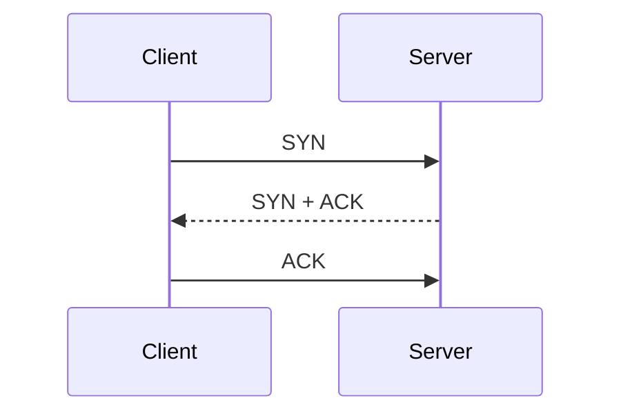

# MoeReview Content Authoring

Use the smallest representation that makes the material easier to understand, remember, or retrieve. Keep ordinary explanation in Markdown and add semantic blocks only when they perform a clear cognitive job.

## Format Selection

- Use headings, lists, tables, and code fences for ordinary structure.
- Use KaTeX for mathematical notation.
- Use Mermaid for standard relationships, flows, states, hierarchies, and sequences.
- Use `html-preview` only for custom layout, animation, simulation, or interaction Mermaid cannot express well.
- Use semantic directives to identify the role of content, not merely to decorate it.
- Keep interactive or large visual blocks in durable pages. Side guidance is compact and should remain ordinary Markdown.

## Semantic Directives

Use standard remark-directive attributes and close every container with `:::`.

### Callout

```markdown
:::callout{type="key" title="Core conclusion"}
The readable explanation goes here.
:::
```

Supported types: `key`, `tip`, `note`, `warning`, `trap`.

### Comparison

Use a Markdown table inside the block. Compare along shared dimensions rather than writing unrelated descriptions.

```markdown
:::compare{title="TCP and UDP"}
| Dimension | TCP | UDP |
|---|---|---|
| Connection | Connection-oriented | Connectionless |
| Reliability | Reliable delivery | Best effort |
:::
```

### Steps

Use an ordered list only when order, dependency, or progression matters.

```markdown
:::steps{title="Three-way handshake"}
1. Client sends `SYN`.
2. Server returns `SYN + ACK`.
3. Client sends `ACK`.
:::
```

### Formula

Use KaTeX inside the block. Explain variables, units, applicability, and common mistakes when relevant.

```markdown
:::formula{title="Average velocity"}
$$
v = \frac{\Delta s}{\Delta t}
$$

- $v$: average velocity
- $\Delta s$: displacement
- $\Delta t$: elapsed time, where $\Delta t \ne 0$
:::
```

Use `$...$` for inline math and `$$...$$` for display math. Do not put formulas in code fences or substitute screenshots for notation KaTeX can render.

### Memory Card

Put the retrieval cue in `prompt`; put the answer in the body. The answer stays collapsed until the learner opens it.

```markdown
:::memory-card{title="TCP reliability" prompt="Why does TCP need acknowledgements and retransmission?"}
Acknowledgements reveal missing data, and retransmission repairs the loss.
:::
```

Keep prompts short and answerable from memory. Use `checkpoint` instead when the learner should solve or explain rather than reveal a stored answer.

### Other Supported Blocks

```markdown
:::concept{title="Concept name"}
Definition, boundary, and intuition.
:::

:::example{title="Worked example"}
Concrete application or derivation.
:::

:::checkpoint{title="Active recall"}
Question the learner should answer before continuing.
:::

:::mistake{title="Common mistake"}
Incorrect intuition, why it fails, and the correction.
:::

:::source{title="Sources"}
References or evidence.
:::
```

Legacy `memory` and `diagram` directives remain readable, but prefer `memory-card` and Mermaid in new content.

## Mermaid

````markdown

````

Use Mermaid when spatial structure communicates more efficiently than prose. Do not turn a simple list into a diagram. Quote or simplify labels containing punctuation when Mermaid parsing would otherwise be ambiguous.

## HTML Preview

````markdown
```html-preview title="Interactive congestion window" height="auto"
<!doctype html>
<html>
<head><style>/* complete responsive CSS */</style></head>
<body>
  <!-- complete HTML -->
  <script>/* complete JavaScript */</script>
</body>
</html>
```
````

The block runs in an isolated iframe with JavaScript enabled. Prefer responsive layouts, support light and dark themes, and use `--preview-bg`, `--preview-text`, `--preview-muted`, `--preview-border`, and `--preview-accent` when useful. External assets are allowed but may fail offline.

## Cognitive Quality

Adapt structure to the subject instead of forcing a fixed lesson template.

- Establish a usable mental model before dense detail when the learner lacks orientation.
- Present differences through shared comparison dimensions.
- Visualize causality, sequence, hierarchy, or state only when the relationship matters.
- Pair formulas with meaning and conditions, not notation alone.
- Compress high-value facts into memorable retrieval cues.
- Add a checkpoint when active recall materially improves learning; not every page needs one.
- Keep one primary purpose per durable page.
- Do not stack blocks merely to make the page look rich.

## Tool-Call Preflight

Before sending page content through MCP, verify:

- `content` is one plain Markdown string, not JSON or a page object;
- directive containers and fenced blocks are closed;
- the title is in the tool's `title` field, not repeated as a JSON wrapper;
- the selected format is the simplest one that communicates the idea well;
- durable pages contain material worth revisiting;
- related page, guidance, progress, and toast updates are batched with `update_workspace` when possible.
